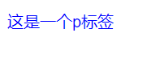
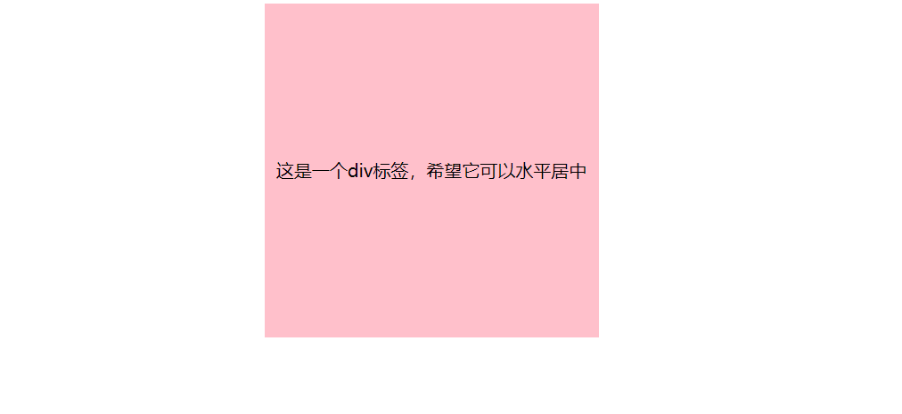

### 层叠性
由于CSS(Cascading Style Sheets)叫做层叠样式表，即一层一层覆盖，最下面的一层会覆盖前一层，因此如果给一个标签设置了两个相同的样式，写在最下面的会生效
```html
<style>
    p{
        color:red;
        color:blue;
    }
</style>
<p>这是一个p标签</p>
```


### 关于颜色
|颜色表示方式|含义|属性值|
|----|----|----|
|关键词|预定义的颜色名|red,blue,green,pink...|
|rgb表示法|红绿蓝三原色，每项取值范围：0-255|rgb(0,0,0),rgb(255,255,255)...|
|rgba表示法|a表示透明度，取值范围：0-1|rgba(0,0,0,0.5)...|
|十六进制表示法|以#开头，数字以十六进制表示|#000000(可简写为#000),#ff0000(可简写为#f00),#e92322...|
### 标签水平居中的写法
是十分常用的写法
```html
<!DOCTYPE html>
<html lang="en">
<head>
    <meta charset="UTF-8">
    <meta http-equiv="X-UA-Compatible" content="IE=edge">
    <meta name="viewport" content="width=device-width, initial-scale=1.0">
    <title>Document</title>
    <style>
        div{
            width: 300px;
            height: 300px;
            background-color: pink;
            text-align: center;
            /* 这句是让文字可以在粉色背景内居中 */
            line-height: 300px;
            margin: 0 auto;
            
        }
    </style>
</head>
<body>
    <div>这是一个div标签，希望它可以水平居中</div>
</body>
</html>
```


### 关于span
A **span** element which is used to color a part of a text:
```html
<p>My mother has <span style="color:blue">blue</span> eyes.</p>
```

* The **span** tag is an inline container used to mark up a part of a text, or a part of a document.
* The **span** tag is easily styled by CSS or manipulated with JavaScript using the class or id attribute.
* The **span** tag is much like the **div** element, but **div** is a block-level element and **span** is an inline element.

### 关于img和背景图片
* 如果是较为重要的图片，需要用img，如产品图，宣传图等
* 而不太重要的图片，就用背景图片，使用CSS的background功能，如网页上一些不太起眼的小图标等

### CSS书写顺序
* 书写顺序：
  + 定位
  + 浮动/display
  + 盒子模型：margin, border, padding, width, height, backgroundcolor...
  + 文字样式

### 关于float和inline-block
* 有一篇文章：[Should You Use Inline-Blocks As A Substitute For Floats?](https://vanseodesign.com/css/inline-blocks/)