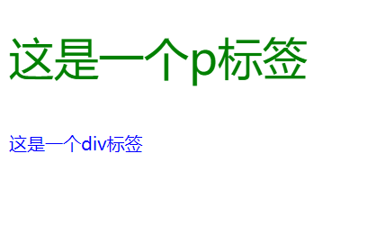

**学习时间：2022.11.06**
## CSS基础认知

### <a id="firstknowcss">CSS初识</a>
```html
<!-- 01-CSS初识.html -->
<!DOCTYPE html>
<html lang="en">
<head>
    <meta charset="UTF-8">
    <meta http-equiv="X-UA-Compatible" content="IE=edge">
    <meta name="viewport" content="width=device-width, initial-scale=1.0">
    <title>CSS初识</title>
    <style>
        /* CSS注释 */
        /* 这里写的都是CSS */
        /* 选择器{CSS属性} */
        /* 选择器作用：查找标签 */
        p {
            /* 文字颜色变为蓝色 */
            color: blue;
            /* 字变大 px指像素 */
            font-size: 60px;
            /* 背景颜色 */
            background-color: aqua;
            /* 改变宽度高度 */
            width: 400px;
            height: 200px;
        }
    </style>
</head>
<body>
    <p>这是一个p标签</p>
</body>
</html>
```


### CSS引入方式

|引入方式|书写位置|作用范围|使用场景|
|----|----|----|----|
|内嵌式|style标签中|当前页面|小案例|
|外联式|独立的CSS文件中，通过link标签引用|多个页面|项目|
|行内式|标签的style属性中|当前标签|配合js使用|

#### 内嵌式
[CSS初识部分代码即内嵌式](#firstknowcss)
#### 外联式和行内式
```html
<!-- 02-CSS外联式和行内式.html -->
<!DOCTYPE html>
<html lang="en">
<head>
    <meta charset="UTF-8">
    <meta http-equiv="X-UA-Compatible" content="IE=edge">
    <meta name="viewport" content="width=device-width, initial-scale=1.0">
    <title>Document</title>
    <!-- 这里链入外部css文件 -->
    <!-- stylesheet是样式表 -->
    <link rel="stylesheet" href="./02-外联式.css">
</head>
<body>
    <p>这是一个p标签</p>
    <!-- 这里用行内式 -->
    <div style="color: blue;">这是一个div标签</div>
</body>
</html>

```
```css
/* 02-外联式.css */
p {
    color: green;
    font-size: 40px;
}
```

