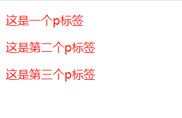
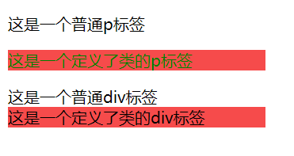
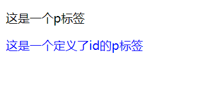
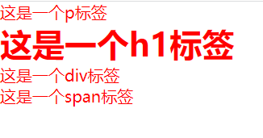

**学习时间：2022.11.07**
[toc]
## 基础选择器

### 标签选择器
* 标签选择器就是以标签名命名的选择器
* 标签选择器将所有该标签内容都生效CSS效果
```html
<!-- 01-标签选择器.html -->
<!DOCTYPE html>
<html lang="en">
<head>
    <meta charset="UTF-8">
    <meta http-equiv="X-UA-Compatible" content="IE=edge">
    <meta name="viewport" content="width=device-width, initial-scale=1.0">
    <title>标签选择器</title>
    <style>
        p{
            color: red;
        }
    </style>
</head>
<body>
    <p>这是一个p标签</p>
    <p>这是第二个p标签</p>
    <p>这是第三个p标签</p>
</body>
</html>
```


### 类选择器
* 类选择器需要定义和使用才能生效
* 在标签内用class定义该标签的类，就可以用“.类名{}”对相同类名的标签进行CSS渲染
* 若想要多个选择器对标签内容进行渲染，只要用空格隔开即可
```html
<!-- 02-类选择器.html -->
<!DOCTYPE html>
<html lang="en">
<head>
    <meta charset="UTF-8">
    <meta http-equiv="X-UA-Compatible" content="IE=edge">
    <meta name="viewport" content="width=device-width, initial-scale=1.0">
    <title>Document</title>
     <style>
        .color{
            color: green;
        }
        .background{
            background-color: rgb(246, 75, 75);
            width: 260px;
        }
     </style>
</head>
<body>
    <p>这是一个普通p标签</p>
    <p class="color background">这是一个定义了类的p标签</p>
    <div>这是一个普通div标签</div>
    <div class="background">这是一个定义了类的div标签</div>
</body>
</html>
```


### id选择器
* 在标签内用id定义该标签的id，就可以用“#id名{}”对相同类名的标签进行CSS渲染
* 但id一般不用于CSS，而是与js配合使用
* 所有标签都有id属性，类似于身份证号，在整个页面是唯一的，不可重复的
* 即一个id选择器只能选中一个标签进行渲染
* 即使有两个标签用了同样的id，并且成功渲染，也是不合法的
```html
<!-- 03-id选择器.html -->
<!DOCTYPE html>
<html lang="en">
<head>
    <meta charset="UTF-8">
    <meta http-equiv="X-UA-Compatible" content="IE=edge">
    <meta name="viewport" content="width=device-width, initial-scale=1.0">
    <title>id选择器</title>
    <style>
        #blue{
            color: blue;
        }
    </style>
</head>
<body>
    <p>这是一个p标签</p>
    <p id="blue">这是一个定义了id的p标签</p>
</body>
</html>
```


### 通配符选择器
* 形式为“*{}”，作用于页面内所有标签
* 使用场景较少，多用于清除标签默认的样式

```html
<!-- 04-通配符选择器.html -->
<!DOCTYPE html>
<html lang="en">
<head>
    <meta charset="UTF-8">
    <meta http-equiv="X-UA-Compatible" content="IE=edge">
    <meta name="viewport" content="width=device-width, initial-scale=1.0">
    <title>通配符选择器</title>
    <style>
        *{
            color: red;
        }

        /* 这是通配符选择器最多的使用场景，用于去除默认样式，这里清除默认的内外边距 */
        *{
            margin: 0%;
            padding: 0%;
        }
        
    </style>
</head>
<body>
    <p>这是一个p标签</p>
    <h1>这是一个h1标签</h1>
    <div>这是一个div标签</div>
    <span>这是一个span标签</span>
</body>
</html>
```
