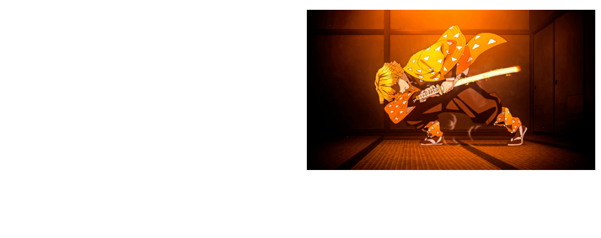

**学习时间：2022.11.07**
[toc]
## 字体和文本样式
### 字体样式
#### 文字基本样式
|字体样式|属性名|取值|其他|
|----|----|----|----|
|字体大小|font-size|数字px|谷歌浏览器默认文字大小是16px|
|字体粗细|font-weight|关键字：normal/bold 数字：100-900的整百数，400为正常，700为加粗|不是所有字体都提供了9种粗细；正常开发中，正常和加粗用得最多|
|字体是否倾斜|font-style|关键字：normal/italic||

```html
<!-- 01-文字基本样式.html -->
<!DOCTYPE html>
<html lang="en">
<head>
    <meta charset="UTF-8">
    <meta http-equiv="X-UA-Compatible" content="IE=edge">
    <meta name="viewport" content="width=device-width, initial-scale=1.0">
    <title>文字基本样式</title>
    <style>
        .size{
            font-size: 40px;
        }
        .weight-keyword{
            font-weight: bold;
        }
        .weight-number{
            font-weight: 700;
        }
        .style{
            font-style: italic;
        }
    </style>
</head>
<body>
    <p>这是一个普通p标签</p>
    <p class="size">这是一个p标签，要用font-size改变大小</p>
    <p class="weight-keyword">这是一个p标签，要用font-weight的关键字改变粗细</p>
    <p class="weight-number">这是一个p标签，要用font-weight的数字方式改变粗细</p>
    <p class="style">这是一个p标签，要用font-style变成倾斜的</p>
</body>
</html>
```

* 一些标签也可以对文字实施同样的效果，如strong,em等。而CSS可以改变这些标签的效果。如em对文字倾斜，选择器em{font-style: normal;}就可以使文字正常。

#### 字体

```html
<!-- 02-字体.html -->
<!DOCTYPE html>
<html lang="en">
<head>
    <meta charset="UTF-8">
    <meta http-equiv="X-UA-Compatible" content="IE=edge">
    <meta name="viewport" content="width=device-width, initial-scale=1.0">
    <title>字体</title>
    <style>
        /* 如果用户的电脑没有宋体，就显示黑体，如果也没有黑体，就显示任意一种无衬线字体 */
        /* sans-serif即无衬线字体 */
        .family{
            font-family: 宋体,黑体,sans-serif;
        }
    </style>
</head>
<body>
    <p>这是一个普通p标签</p>
    <p class="family">这是一个p标签，要用font-family变成宋体</p>
</body>
</html>
```


#### font复合属性
* 取值为 font：style weight size family
* 类似这种一个属性后可以跟上多个取值的，都叫做复合属性
* 可以省略，但最多只能省略前两个。省略代表使用默认值

```html
<!-- 03-font复合属性.html -->
<!DOCTYPE html>
<html lang="en">
<head>
    <meta charset="UTF-8">
    <meta http-equiv="X-UA-Compatible" content="IE=edge">
    <meta name="viewport" content="width=device-width, initial-scale=1.0">
    <title>font复合属性</title>
    <style>
        .font4{
            font:italic 700 30px 宋体;
        }
        .font2{
            font:700 30px 宋体;
        }
    </style>
</head>
<body>
    <p>这是一个普通p标签</p>
    <p class="font4">这是一个p标签，要用font复合属性渲染</p>
    <p class="font2">这是一个p标签，要用font复合属性（省略前两个属性）渲染</p>
</body>
</html>
```


### 文本样式
#### 文本缩进
* 属性名:text-indent
* 取值:
  + 数字px
  + 数字em(1em=一个字的大小)

```html
<!-- 04-文本缩进.html -->
<!DOCTYPE html>
<html lang="en">
<head>
    <meta charset="UTF-8">
    <meta http-equiv="X-UA-Compatible" content="IE=edge">
    <meta name="viewport" content="width=device-width, initial-scale=1.0">
    <title>文本缩进</title>
    <style>
        div{
            text-indent: 32px;
            font-size: 20px;
        }
        p{
            text-indent: 2em;
            font-size: 20px;
        }
    </style>
</head>
<body>
    <div>这段话的字号是20px，但文本缩进是32px   &nbsp; &nbsp; &nbsp; &nbsp; &nbsp; &nbsp; &nbsp; &nbsp; &nbsp; &nbsp; &nbsp;工信部发布《开展智能网联汽车准入和上路通行试点工作的通知（征求意见稿）》，在全国智能网联汽车道路测试与示范应用工作基础上，工业和信息化部、公安部遴选符合条件的道路机动车辆生产企业和具备量产条件的搭载自动驾驶功能的智能网联汽车产品，开展准入试点；对通过准入试点的智能网联汽车产品，在试点城市的限定公共道路区域内开展上路通行试点。</div>
    <p>这段话的字号是20px，文本缩进是2em  &nbsp; &nbsp; &nbsp; &nbsp; &nbsp; &nbsp; &nbsp; &nbsp; &nbsp; &nbsp; &nbsp;工信部发布《开展智能网联汽车准入和上路通行试点工作的通知（征求意见稿）》，在全国智能网联汽车道路测试与示范应用工作基础上，工业和信息化部、公安部遴选符合条件的道路机动车辆生产企业和具备量产条件的搭载自动驾驶功能的智能网联汽车产品，开展准入试点；对通过准入试点的智能网联汽车产品，在试点城市的限定公共道路区域内开展上路通行试点。</p>
</body>
</html>
```


#### 文本水平对齐方式
* 属性名：text-align
* 取值：
  + 左对齐：left
  + 居中对齐：center
  + 右对齐：right
* 虽然该标签命名为文本水平对齐方式，实际上它还可以对齐以下几种元素：
  + 文本
  + span标签，a标签
  + input标签，img标签
* 重点在于，如果要让以上元素对齐，需要对其父元素进行设置
```html
  <!-- abc的父元素是p标签 -->
  <p>abc</p> 
  <!-- 该图片的父元素是body标签 -->
  <body>
    
</body>
```
```html
<!-- 05-文本水平对齐方式.html -->
<!DOCTYPE html>
<html lang="en">
<head>
    <meta charset="UTF-8">
    <meta http-equiv="X-UA-Compatible" content="IE=edge">
    <meta name="viewport" content="width=device-width, initial-scale=1.0">
    <title>文本水平对齐方式</title>
    <style>
        h1{
            text-align: right;
        }
        body{
            text-align: center;
        }
    </style>
</head>
<body>
    <h1>这是一个h1标签，要用text-align右对齐</h1>
    
</body>
</html>
```


* <font color="red">不懂的地方</font>
  + <font color="red">如果使用body标签对其内容进行对齐处理，则整个body内部都会被一起处理，有什么办法可以只处理某一张图片而不会影响到其他标签</font>
  + <font color="red">之前学习过CSS是层层叠叠渲染，而在上面代码中，无论把h1选择器放在body选择器的上面或者下面，都会使得文字右对齐；而如果说body选择器对于文字没有影响，没有h1选择器的时候文字同样会居中。总而言之，我不是很理解这部分的“父元素”是指直接父元素还是说调整祖父元素也可以影响到目的内容</font>
* 针对上面不懂的地方，我在StackOverFlow上找到了以下两种方法使得图片居中对齐或者按照自己想要的方式对齐
  + 居中对齐
```html
<style>
        /* body{
            text-align: center;
        } */
        /* 还没学习到这里的知识点 */
        img.shan{
            width: 400px;
            display: block;
            margin: 0 auto;
        }
</style>

<body>
    
</body>
```

  + 按照自己想要的方式对齐(将img标签放入其他标签内)
```html
<style>
        img{
            width: 400px;     
        }
        p{
            text-align: right;
        }
</style>
<body>
    <p>
        
    </p>
</body>
```


#### 文本修饰
* 属性名：text-decoration
* 取值：
  + 下划线（不常用）：underline
  + 删除线（不常用）：line-through
  + 上划线（不常用）：overline
  + **无装饰线（常用）**：none
* 无装饰线none常用于清除某些标签默认的下划线
```html
<!-- 06-文本修饰.html -->
<!DOCTYPE html>
<html lang="en">
<head>
    <meta charset="UTF-8">
    <meta http-equiv="X-UA-Compatible" content="IE=edge">
    <meta name="viewport" content="width=device-width, initial-scale=1.0">
    <title>文本修饰</title>
    <style>
        p.a{
            text-decoration: underline;
        }
        div.a{
            text-decoration: line-through;
        }
        div.b{
            text-decoration: overline;
        }
        a.a{
            text-decoration: none;
        }
    </style>
</head>
<body>
    <p>这是一个普通p标签</p>
    <p class="a">这是一个p标签，要用text-decoration加下划线</p>
    <div>这是一个普通div标签</div>
    <div class="a">这是一个div标签，要用text-decoration加删除线</div>
    <br>
    <div class="b">这又是一个div标签，要用text-decoration加上划线</div>
    <a href="">这是一个普通a标签</a><br>
    <a href="" class="a">这是一个a标签，要用text-decoration去掉默认下划线</a>
</body>
</html>
```

### 行高
* 属性名：line-height
* 取值：
  + 数字px
  + 当前字体大小的倍数
* 使用font连写的时候，格式为
  + font style weight size/line-height family
* 行间距具体指的是从文字上方空隙一半处到下方空隙一半处，如图


```html
<!-- 07-行高.html -->
<!DOCTYPE html>
<html lang="en">
<head>
    <meta charset="UTF-8">
    <meta http-equiv="X-UA-Compatible" content="IE=edge">
    <meta name="viewport" content="width=device-width, initial-scale=1.0">
    <title>行高</title>
    <style>
        p.a{
            line-height: 30px;
        }
        p.b{
            line-height: 3;
        }
        p.c{
            font:italic 700 20px/2 宋体 
        }
    </style>
</head>
<body>
    <p class="a">用数字px调整行高为30px&nbsp;&nbsp;&nbsp;&nbsp;&nbsp;&nbsp;工信部发布《开展智能网联汽车准入和上路通行试点工作的通知（征求意见稿）》，对通过准入试点的智能网联汽车产品，在试点城市的限定公共道路区域内开展上路通行试点。</p>

    <p class="b">用当前字体大小倍数调整行高为字体的3倍&nbsp;&nbsp;&nbsp;&nbsp;&nbsp;&nbsp;工信部发布《开展智能网联汽车准入和上路通行试点工作的通知（征求意见稿）》，对通过准入试点的智能网联汽车产品，在试点城市的限定公共道路区域内开展上路通行试点。</p>

    <p class="c">用font连写使得文字字号20px，字体宋体，加粗，行间距2倍，倾斜&nbsp;&nbsp;&nbsp;&nbsp;&nbsp;&nbsp;工信部发布《开展智能网联汽车准入和上路通行试点工作的通知（征求意见稿）》，对通过准入试点的智能网联汽车产品，在试点城市的限定公共道路区域内开展上路通行试点。</p>
</body>
</html>
```
