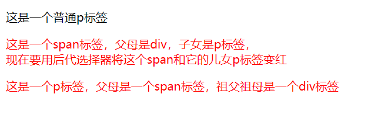
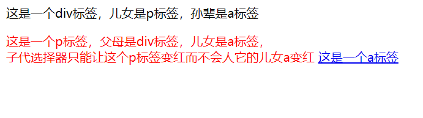
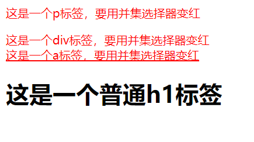
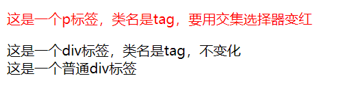
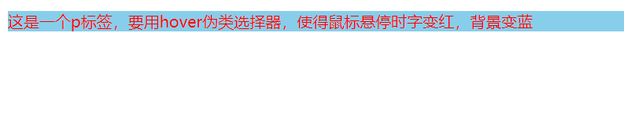

**学习时间：2022.11.09**
## 选择器进阶
### 复合选择器
#### 后代选择器
* 格式：
  + 选择器父母 选择器子女 选择器孙辈 选择器重孙辈{}
  + 上面选中的是重孙辈标签作为CSS渲染对象
```html
<!-- 01-后代选择器,html -->
<!DOCTYPE html>
<html lang="en">
<head>
    <meta charset="UTF-8">
    <meta http-equiv="X-UA-Compatible" content="IE=edge">
    <meta name="viewport" content="width=device-width, initial-scale=1.0">
    <title>后代选择器</title>
    <style>
        div span p {
            color: red;
        }
    </style>
</head>
<body>
    <p>这是一个普通p标签</p>
    <div>
        <span>
            这是一个span标签，父母是div，子女是p标签
            <p>这是一个p标签，父母是一个span标签，祖父祖母是一个div标签，<br> 现在要用后代选择器将这个p标签的内容变红</p>
        </span>
    </div>
</body>
</html>
```


#### 子代选择器
* 格式：
  + 父母选择器>子女选择器{}
  + 子代选择器仅能选中子女标签，而不会对孙辈、重孙辈等后代做任何处理
```html
<!-- 02-子代选择器.html -->
<!DOCTYPE html>
<html lang="en">
<head>
    <meta charset="UTF-8">
    <meta http-equiv="X-UA-Compatible" content="IE=edge">
    <meta name="viewport" content="width=device-width, initial-scale=1.0">
    <title>子代选择器</title>
    <style>
        div>p{
            color: red;
        }
    </style>
</head>
<body>
    <div>
        这是一个div标签，儿女是p标签，孙辈是a标签
        <p>
            这是一个p标签，父母是div标签，儿女是a标签，<br> 子代选择器只能让这个p标签变红而不会人它的儿女a变红
            <a href="#">这是一个a标签</a>
        </p>
    </div>
</body>
</html>
```


### 并集选择器
* 格式：
  + 选择器1，选择器2，选择器3{}
  + 对n个选择器全部内容进行渲染
  + 为代码美观清晰，一个选择器占一行
```html
<!-- 03-并集选择器.html -->
<!DOCTYPE html>
<html lang="en">
<head>
    <meta charset="UTF-8">
    <meta http-equiv="X-UA-Compatible" content="IE=edge">
    <meta name="viewport" content="width=device-width, initial-scale=1.0">
    <title>并集选择器</title>
    <style>
        p,
        div,
        a{
            color: red ;
        }
    </style>
</head>
<body>
    <p>这是一个p标签，要用并集选择器变红</p>
    <div>这是一个div标签，要用并集选择器变红</div>
    <a href="#">这是一个a标签，要用并集选择器变红</a>
    <h1>这是一个普通h1标签</h1>
</body>
</html>
```

### 交集选择器
* 格式
  + 选择器1选择器2{}
  + 对即是选择器1又是选择器2的内容进行渲染
  + 选择器中如果有标签选择器，必须放在最前面

```html
<!-- 04-交集选择器.html -->
<!DOCTYPE html>
<html lang="en">
<head>
    <meta charset="UTF-8">
    <meta http-equiv="X-UA-Compatible" content="IE=edge">
    <meta name="viewport" content="width=device-width, initial-scale=1.0">
    <title>交集选择器</title>
    <style>
        p.tag{
            color: red;
        }
    </style>
</head>
<body>
    <p class="tag">这是一个p标签，类名是tag，要用交集选择器变红</p>
    <div class="tag">这是一个div标签，类名是tag，不变化</div>
    <div>这是一个普通div标签</div>
</body>
</html>
```


### hover伪类选择器
* 设置鼠标悬停时的状态
* 格式：
  + 选择器:hover{}
```html
<!-- 05-hover伪类选择器.html -->
<!DOCTYPE html>
<html lang="en">
<head>
    <meta charset="UTF-8">
    <meta http-equiv="X-UA-Compatible" content="IE=edge">
    <meta name="viewport" content="width=device-width, initial-scale=1.0">
    <title>hover伪类选择器</title>
    <style>
        p:hover{
            color: red;
            background-color: skyblue;
        }
    </style>
</head>
<body>
    <p>这是一个p标签，要用hover伪类选择器，使得鼠标悬停时字变红，背景变蓝</p>
</body>
</html>
```

### Emmet语法
* 用于快速打代码
```html
<!DOCTYPE html>
<html lang="en">
<head>
    <meta charset="UTF-8">
    <meta http-equiv="X-UA-Compatible" content="IE=edge">
    <meta name="viewport" content="width=device-width, initial-scale=1.0">
    <title>emmet语法</title>
    <style>
        div{
            /* 背景颜色 bgc */
            background-color: #fff;
            /* 高度200宽度300背景颜色粉色 w300+h200+bgc */
            width: 300px;
            height: 200px;
            background-color: pink;
        }
    </style>
</head>
<body>
    <!-- .class -->
    <div class="class"></div>
    <!-- p.class -->
    <p class="class"></p>
    <!-- p#id -->
    <p id="id"></p>
    <!-- 同级2个标签 div+p -->
    <div></div>
    <p></p>
    <!-- 父母子女标签 div>p -->
    <div>
        <p></p>
    </div>
    <!-- ul里面3个li标签 ul>li*3 -->
    <ul>
        <li></li>
        <li></li>
        <li></li>
    </ul>
    <!-- ul里面3个li标签,内容为111 ul>li{111}*3 -->
    <ul>
        <li>111</li>
        <li>111</li>
        <li>111</li>
    </ul>
    <!--ul里3个li标签内容分别为1,2,3 ul>li{$}*3  -->
    <ul>
        <li>1</li>
        <li>2</li>
        <li>3</li>
    </ul>
</body>
</html>
```