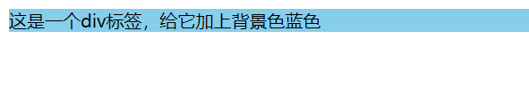
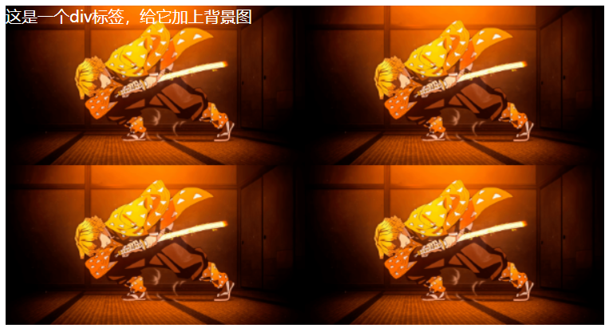
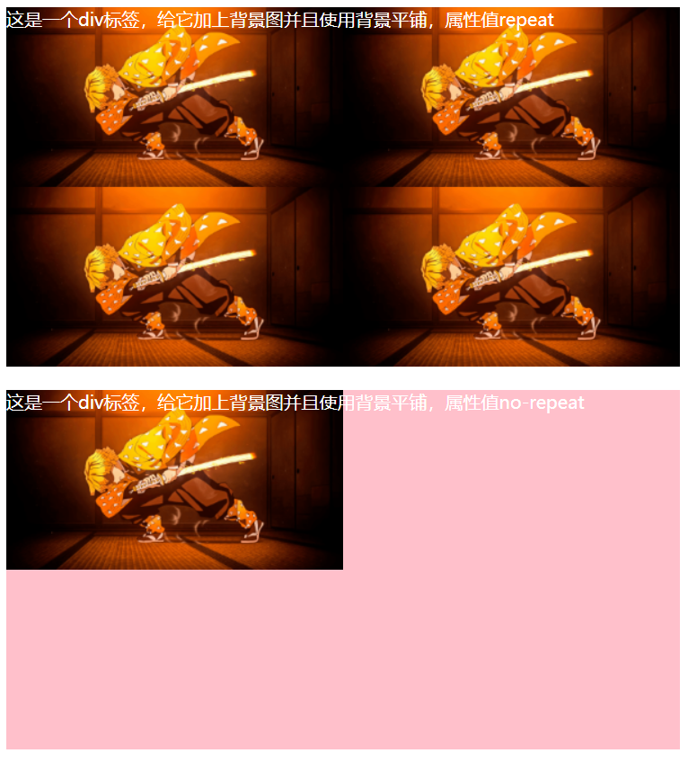
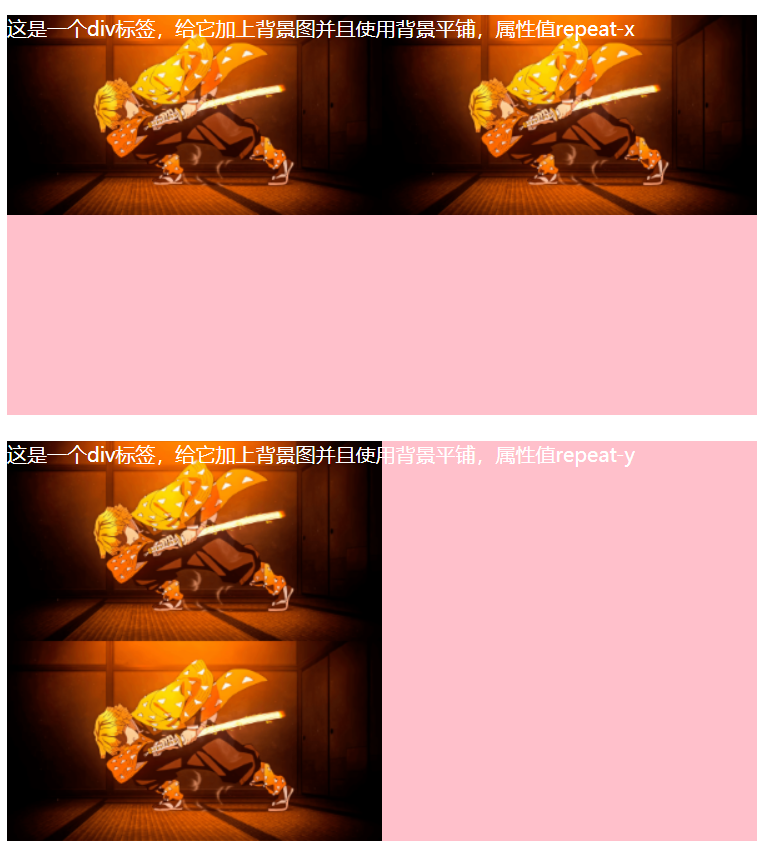
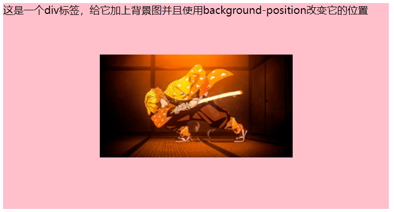
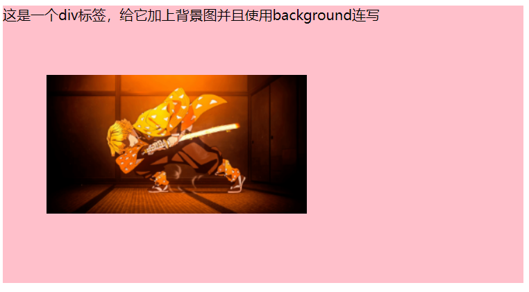

**学习时间：2022.11.11**
## 背景相关属性
### 背景颜色
* 背景颜色默认透明
  + rgba(0,0,0,0)或transparent
```html
<!-- 01=背景颜色.html -->
<!DOCTYPE html>
<html lang="en">
<head>
    <meta charset="UTF-8">
    <meta http-equiv="X-UA-Compatible" content="IE=edge">
    <meta name="viewport" content="width=device-width, initial-scale=1.0">
    <title>背景颜色</title>
    <style>
        div{
            background-color: skyblue;
        }
    </style>
</head>
<body>
    <div>这是一个div标签，给它加上背景色蓝色</div>
</body>
</html>
```


### 背景图
* 此处只是简单的把背景图放到标签盒子里，如果盒子比图片大就自动用复制图片填满标签，如果小就只能显示图片的一部分
```html
<!-- 02-背景图.html -->
<!DOCTYPE html>
<html lang="en">
<head>
    <meta charset="UTF-8">
    <meta http-equiv="X-UA-Compatible" content="IE=edge">
    <meta name="viewport" content="width=device-width, initial-scale=1.0">
    <title>背景图</title>
    <style>
        div{
            width: 800px;
            height: 600px;
            color: #fff;
            background-image: url(../markdown笔记/images/03-06.png);
        }
    </style>
</head>
<body>
    <div>这是一个div标签，给它加上背景图</div>
</body>
</html>
```


### 背景平铺
* 属性名：background-repeat
* 属性值：
  + repeat：默认水平垂直方向都平铺
  + no-repeat：不平铺
  + repeat-x：水平方向平铺
  + repeat-y：垂直方向平铺
```html
<!-- 03-背景平铺.html -->
<!DOCTYPE html>
<html lang="en">
<head>
    <meta charset="UTF-8">
    <meta http-equiv="X-UA-Compatible" content="IE=edge">
    <meta name="viewport" content="width=device-width, initial-scale=1.0">
    <title>背景平铺</title>
    <style>
        div{
            width: 600px;
            height: 320px;
            background-color: pink;
            color: #fff;
            background-image: url(../markdown笔记/images/05-03.png);

        }
        .a{
            background-repeat: repeat;
        }
        .b{
            background-repeat: no-repeat;
        }
        .c{
            background-repeat: repeat-x;
        }
        .d{
            background-repeat: repeat-y;
        }
    </style>
</head>
<body>
    <div class="a">这是一个div标签，给它加上背景图并且使用背景平铺，属性值repeat</div><br>
    <div class="b">这是一个div标签，给它加上背景图并且使用背景平铺，属性值no-repeat</div><br>
    <div class="c">这是一个div标签，给它加上背景图并且使用背景平铺，属性值repeat-x</div><br>
    <div class="d">这是一个div标签，给它加上背景图并且使用背景平铺，属性值repeat-y</div><br>
</body>
</html>
```



### 背景位置
* 属性名：background-position
* 属性值：
  + 数字：横坐标数字px 纵坐标数字px
  + 方位名词：水平(left center right) 垂直(top center bottom)
  + 数字和方位名词可以混用
* 原点在盒子左上角，水平向右为x轴正向，垂直向下为y轴正向
* 图片位置同样以左上角处为准，左上角与坐标重合
```html
<!-- 04-背景位置.html -->
<!DOCTYPE html>
<html lang="en">
<head>
    <meta charset="UTF-8">
    <meta http-equiv="X-UA-Compatible" content="IE=edge">
    <meta name="viewport" content="width=device-width, initial-scale=1.0">
    <title>背景位置</title>
    <style>
        div{
            width: 600px;
            height: 320px;
            background-color: pink;
            background-image: url(../markdown笔记/images/05-03.png);
            background-repeat: no-repeat;
            background-position: center;
            /* background-position: right bottom;
            background-position: left 80px; */
        }
    </style>
</head>
<body>
    <div>这是一个div标签，给它加上背景图并且使用background-position改变它的位置</div>
</body>
</html>
```


### background相关属性连写
* 书写顺序：
  + background:color image repeat position
  + 上面是推荐书写顺序，实际上没有确定的顺序，可以随意写
```html
<!-- 05-背景相关属性连写.html -->
<!DOCTYPE html>
<html lang="en">
<head>
    <meta charset="UTF-8">
    <meta http-equiv="X-UA-Compatible" content="IE=edge">
    <meta name="viewport" content="width=device-width, initial-scale=1.0">
    <title>背景相关属性连写</title>
    <style>
        div{
            width: 600px;
            height: 320px;
            background: pink url(../markdown笔记/images/05-03.png) no-repeat 50px 80px;
        }
    </style>
</head>
<body>
    <div>这是一个div标签，给它加上背景图并且使用background连写</div>
</body>
</html>
```



