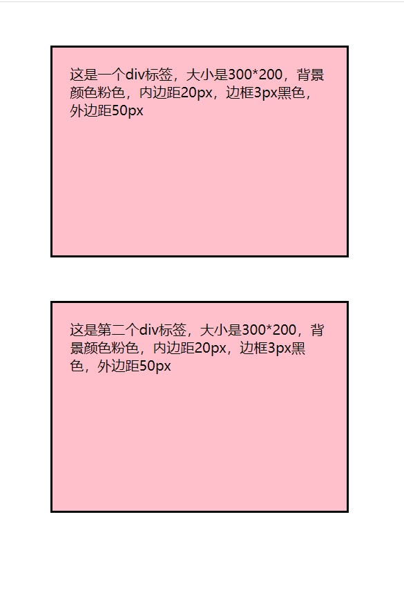
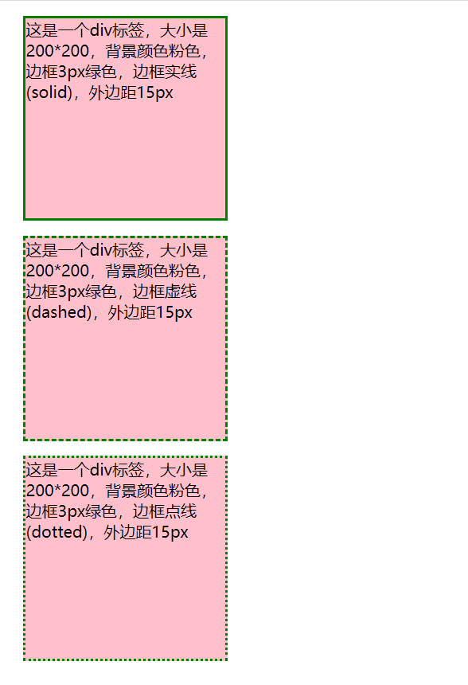
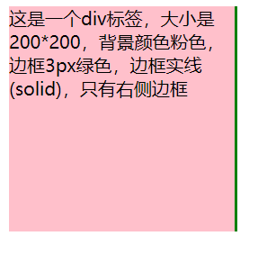
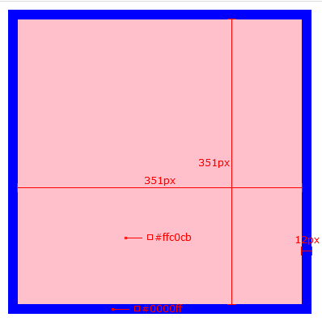

**学习时间：2022.11.13**
[toc]
## 盒子模型
### 盒子模型的介绍
* 每个标签都可以看做是一个盒子
* 盒子模型分为：
  + 内容区域(content)，内边距区域(padding)，边框区域(border)，外边距区域(margin)
```html
<!-- 01-盒子模型的介绍体验.html -->
<!DOCTYPE html>
<html lang="en">
<head>
    <meta charset="UTF-8">
    <meta http-equiv="X-UA-Compatible" content="IE=edge">
    <meta name="viewport" content="width=device-width, initial-scale=1.0">
    <title>盒子模型的介绍和体验</title>
    <style>
        div{
            width: 300px;
            height: 200px;
            background-color: pink;
            border: 3px solid #000;
            padding: 20px;
            margin: 50px;
        }
    </style>
</head>
<body>
    <div>这是一个div标签，大小是300*200，背景颜色粉色，内边距20px，边框3px黑色，外边距50px</div>
    <div>这是第二个div标签，大小是300*200，背景颜色粉色，内边距20px，边框3px黑色，外边距50px</div>
</body>
</html>
```


### 内容的宽高
* width和height属性用于设置盒子的宽高
### 边框(border)
#### 连写形式
* 格式：
  + border:边框粗细 线条样式 线条颜色
  + 三个取值没有先后顺序
  + 其中线条样式有实线(solid)，虚线(dashed)，点线(dotted)等
```html
<!-- 02-边框-1.html -->
<!DOCTYPE html>
<html lang="en">
<head>
    <meta charset="UTF-8">
    <meta http-equiv="X-UA-Compatible" content="IE=edge">
    <meta name="viewport" content="width=device-width, initial-scale=1.0">
    <title>边框-1</title>
    <style>
        div{
            width: 200px;
            height: 200px;
            background-color: pink;
            margin: 15px;
        }
        .a{
            border: 3px solid green;
        }
        .b{
            border: 3px dashed green;
        }
        .c{
            border: 3px dotted green;
        }
    </style>
</head>
<body>
    <div class="a">这是一个div标签，大小是200*200，背景颜色粉色，边框3px绿色，边框实线(solid)，外边距15px</div>
    <div class="b">这是一个div标签，大小是200*200，背景颜色粉色，边框3px绿色，边框虚线(dashed)，外边距15px</div>
    <div class="c">这是一个div标签，大小是200*200，背景颜色粉色，边框3px绿色，边框点线(dotted)，外边距15px</div>
</body>
</html>
```

#### 单方向设置
* 格式：
  + border-方位名词
```html
<!-- 03-边框-2.html -->
<!DOCTYPE html>
<html lang="en">
<head>
    <meta charset="UTF-8">
    <meta http-equiv="X-UA-Compatible" content="IE=edge">
    <meta name="viewport" content="width=device-width, initial-scale=1.0">
    <title>边框-2</title>
    <style>
        div{
            width: 200px;
            height: 200px;
            background-color: pink;
            border-right: 3px green solid;
        }
    </style>
</head>
<body>
    <div>这是一个div标签，大小是200*200，背景颜色粉色，边框3px绿色，边框实线(solid)，只有右侧边框</div>
</body>
</html>
```


#### 单个属性
* 用于设置边框粗细，样式，颜色：
  + 边框粗细：border-width
  + 边框样式：border-style
  + 边框颜色：border-color
* 因为连写会更方便，因此这三个单独属性很少使用

### 简单案例
* 使用pxcook测量盒子尺寸
* 打出相应代码


```html
<!DOCTYPE html>
<html lang="en">
<head>
    <meta charset="UTF-8">
    <meta http-equiv="X-UA-Compatible" content="IE=edge">
    <meta name="viewport" content="width=device-width, initial-scale=1.0">
    <title>普通盒子</title>
    <style>
        div{
            width: 351px;
            height: 351px;
            background-color:  #ffc0cb;
            border: 12px solid #00f;
        }
    </style>
</head>
<body>
    <div></div>
</body>
</html>
```
### 内边距(padding)
* 格式
  + padding:数字px
  + padding后最少跟1个值，最多跟4个
  + 4值：按照顺时针顺序，上右下左依次赋值
  + 3值：同样顺时针顺序，赋给上右下，左和右相同
  + 2值：赋给上右，上下相同，左右相同
  + 1值：上下左右均相同
* 同样也可以使用padding-left, padding-right, paddin-top, padding-bottom来设置相应值
```html
<!-- 04-内边距.html -->
<!DOCTYPE html>
<html lang="en">
<head>
    <meta charset="UTF-8">
    <meta http-equiv="X-UA-Compatible" content="IE=edge">
    <meta name="viewport" content="width=device-width, initial-scale=1.0">
    <title>内边距</title>
    <style>
        div{
            width: 200px;
            height: 200px;
            background-color: pink;
            padding: 20px 30px 40px 50px;
            /* padding: 20px 30px 40px;
            padding: 20px 30px;
            padding: 20px; */
        }
    </style>
</head>
<body>
    <div>这是一个div标签</div>
</body>
</html>
```
### 内减模式
* border和padding会将盒子撑大，有2种方法解决
  + 手动内减：手动减去多余大小
  + 自动内减：给盒子设置属性box-sizing:border-box即可
* 自动内减属性可以让盒子变为CSS3的的盒子模型
```html
<!-- 05-内减模式.html -->
<!DOCTYPE html>
<html lang="en">
<head>
    <meta charset="UTF-8">
    <meta http-equiv="X-UA-Compatible" content="IE=edge">
    <meta name="viewport" content="width=device-width, initial-scale=1.0">
    <title>内减模式</title>
    <style>
        div{
            width: 200px;
            height: 200px;
            background-color: pink;
            padding: 20px;
            border: 10px solid green;
            box-sizing: border-box;
        }
    </style>
</head>
<body>
    <div></div>
</body>
</html>
```
### 外边距(margin)
* 外边距与内边距的使用完全相同
#### 外边距折叠现象1-合并现象
* 垂直布局的块级元素，上下的margin会合并，取最大值
* 解决办法：
  + 只给其中一个元素设置margin即可
#### 外边距折叠现象2-塌陷现象
* 相互嵌套的块级元素，子女元素的margin-top会作用在父母元素上，导致父母元素一起向下移动
* 解决办法：
  + 给父母元素设置border-top或者padding-top，分隔父母子女元素的margin-top
  + 给父母元素设置overflow: hidden(最高级的办法)
  + 将某个元素转换成行内块元素(因为塌陷现象仅对块级元素生效)
  + 设置浮动：使用.clearfix::before解决塌陷问题，具体代码如下
  ```html
  <!-- 下面的代码同时解决塌陷问题和浮动带来的问题 -->
  <!-- 这里使用display: table，父母子女标签不再是块级元素，解决塌陷 -->
  .clearfix::before,
  .clearfix::after{
    content: '';
    display: table;
  }
  <!-- 这里使用clear:both清除浮动 -->
  .clearfix::after{
    clear:both;
  }
  ```
#### 行内标签的内外边距问题
* 无法通过margin或者padding改变行内标签的垂直位置，只能改变水平位置
* 即margin-top, margin-bottom, padding-top, padding-bottom并不会对行内标签生效
* 垂直位置使用line-height来改变
