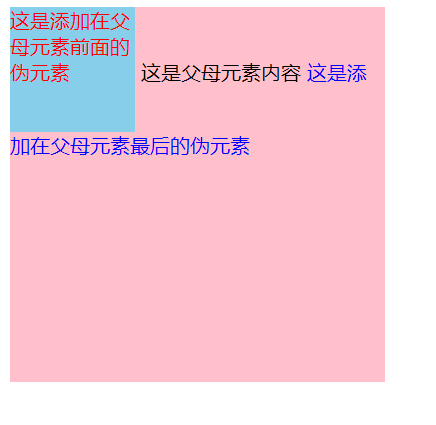

**学习时间：2022.11.14**
[toc]
## 浮动
### 结构伪类选择器
* 根据元素在HTML的关系查找元素
* 可以减少HTML对类的依赖，保持代码的整洁
* 用于查找某父母级元素的子女元素
* 选择器名：
  + E: first-child{} 匹配父母元素中第一个E元素
  + E: last-child{} 匹配父母元素中最后一个E元素
  + E: nth-child(n){} 匹配父母元素中第n个E元素
  + E: nth-last-child(n){} 匹配父母元素中倒数第n个E元素
```html
<!-- 01-结构伪类选择器.html -->
<!DOCTYPE html>
<html lang="en">
<head>
    <meta charset="UTF-8">
    <meta http-equiv="X-UA-Compatible" content="IE=edge">
    <meta name="viewport" content="width=device-width, initial-scale=1.0">
    <title>结构伪类选择器</title>
    <style>
        li:first-child{
            background-color: #000;
        }
        li:last-child{
            background-color: green;
        }
        li:nth-child(7){
            background-color: pink;
        }
        li:nth-last-child(7){
            background-color: red;
        }
    </style>
</head>
<body>
    <ul>
        <li>这是第1个li标签</li>
        <li>这是第2个li标签</li>
        <li>这是第3个li标签</li>
        <li>这是第4个li标签</li>
        <li>这是第5个li标签</li>
        <li>这是第6个li标签</li>
        <li>这是第7个li标签</li>
        <li>这是第8个li标签</li>
    </ul>
</body>
</html>
```
* 在E: nth-child(n){} 和 E: nth-last-child(n){} 中，不但能填写数字，还能填写公式
* n的取值范围：
  + 0, 1, 2, 3, 4, 5, 6, 7...
  + 偶数：2n, even
  + 奇数：2n+1, 2n-1, odd
  + 前3个：-n+3
  + 第3个往后：n+3
```html
<!-- 02-结构伪类选择器-公式.html -->
<!DOCTYPE html>
<html lang="en">
<head>
    <meta charset="UTF-8">
    <meta http-equiv="X-UA-Compatible" content="IE=edge">
    <meta name="viewport" content="width=device-width, initial-scale=1.0">
    <title>结构伪类选择器-公式</title>
    <style>
        li:nth-child(2n){
            background-color: pink;
        }
        li:nth-last-child(-n+3){
            background-color: green;
        }
    </style>
</head>
<body>
    <ul>
        <li>这是第1个li标签</li>
        <li>这是第2个li标签</li>
        <li>这是第3个li标签</li>
        <li>这是第4个li标签</li>
        <li>这是第5个li标签</li>
        <li>这是第6个li标签</li>
        <li>这是第7个li标签</li>
        <li>这是第8个li标签</li>
    </ul>
</body>
</html>
```
### 伪元素
* 页面非主体内容，一些装饰性的内容可以使用伪元素
* 伪元素是由CSS模拟出的标签
* 种类：
  + ::before 在父母元素内容的最前面加一个伪元素
  + ::after 在父母元素内容的最后面加一个伪元素
* 注意事项：
  + 只有添加了content属性，伪元素才会生效
  + 伪元素默认是行内元素
```html
<!-- 03-伪元素.html -->
<!DOCTYPE html>
<html lang="en">
<head>
    <meta charset="UTF-8">
    <meta http-equiv="X-UA-Compatible" content="IE=edge">
    <meta name="viewport" content="width=device-width, initial-scale=1.0">
    <title>伪元素</title>
    <style>
        .parent{
            width: 300px;
            height: 300px;
            background-color: pink;
        }
        .parent::before{
            content: '这是添加在父母元素前面的伪元素';
            color: red;
            display: inline-block;
            width: 100px;
            height: 100px;
            background-color: skyblue;
        }
        .parent::after{
            content: '这是添加在父母元素最后的伪元素';
            color: blue;
        }
    </style>
</head>
<body>
    <div class="parent">
        这是父母元素内容
    </div>
</body>
</html>
```

### 浮动
#### 浮动的作用
* 当我们希望两个盒子在同一行时，可以使用将其转换为行内块标签。但缺点在于，如果希望两个盒子挨在一起，就要在body部分把相应的两个标签放在一行。这样的代码可读性差，不够整齐。
* 因此我们需要浮动来解决页面布局的问题
* 早期浮动用于图文环绕
* 现在浮动用于网页布局
```html
<!-- 04-浮动-体验.html -->
<!DOCTYPE html>
<html lang="en">
<head>
    <meta charset="UTF-8">
    <meta http-equiv="X-UA-Compatible" content="IE=edge">
    <meta name="viewport" content="width=device-width, initial-scale=1.0">
    <title>浮动-体验</title>
    <style>
        img{
            float: left;
        }
        .one, .two{
            width: 100px;
            height: 100px;
        }
        .one{
            background-color: pink;
            float: left;
        }
        .two{
            background-color: green;
            float: left;
        }
    </style>
</head>
<body>
    <!-- 早期浮动的作用-图文环绕 -->
    
    <div class="arumin">进击的巨人阿尔敏进击的巨人阿尔敏进击的巨人阿尔敏进击的巨人阿尔敏进击的巨人阿尔敏进击的巨人阿尔敏进击的巨人阿尔敏进击的巨人阿尔敏进击的巨人阿尔敏进击的巨人阿尔敏进击的巨人阿尔敏进击的巨人阿尔敏进击的巨人阿尔敏进击的巨人阿尔敏进击的巨人阿尔敏进击的巨人阿尔敏进击的巨人阿尔敏进击的巨人阿尔敏进击的巨人阿尔敏进击的巨人阿尔敏进击的巨人阿尔敏进击的巨人阿尔敏进击的巨人阿尔敏进击的巨人阿尔敏进击的巨人阿尔敏进击的巨人阿尔敏进击的巨人阿尔敏进击的巨人阿尔敏进击的巨人阿尔敏进击的巨人阿尔敏进击的巨人阿尔敏进击的巨人阿尔敏进击的巨人阿尔敏进击的巨人阿尔敏进击的巨人阿尔敏进击的巨人阿尔敏进击的巨人阿尔敏进击的巨人阿尔敏进击的巨人阿尔敏进击的巨人阿尔敏进击的巨人阿尔敏进击的巨人阿尔敏进击的巨人阿尔敏进击的巨人阿尔敏进击的巨人阿尔敏进击的巨人阿尔敏进击的巨人阿尔敏进击的巨人阿尔敏进击的巨人阿尔敏进击的巨人阿尔敏进击的巨人阿尔敏进击的巨人阿尔敏进击的巨人阿尔敏进击的巨人阿尔敏进击的巨人阿尔敏进击的巨人阿尔敏进击的巨人阿尔敏进击的巨人阿尔敏进击的巨人阿尔敏进击的巨人阿尔敏进击的巨人阿尔敏进击的巨人阿尔敏进击的巨人阿尔敏进击的巨人阿尔敏进击的巨人阿尔敏进击的巨人阿尔敏进击的巨人阿尔敏进击的巨人阿尔敏进击的巨人阿尔敏进击的巨人阿尔敏进击的巨人阿尔敏进击的巨人阿尔敏</div>

    <!-- 现在的浮动作用-网页布局 -->
    <div class="one">这是一个div标签</div>
    <div class="two">这是一个div标签</div>
</body>
</html>
```


#### 浮动的特点
* 浮动会脱离标准流，在标准流中不占位置，相当于从地面飘到了空中
* 浮动元素比标准流高半个级别，可以覆盖标准流中的元素
* 浮动找浮动，下一个浮动元素会在上一个浮动元素后面左右浮动
* 浮动的标签是顶对齐的，如果想要标签向下移动，使用外边距margin-top就可以
* 浮动后的标签具有行内块的性质
* margin: 0 auto和text-align: center不会对浮动元素生效
```html
<!-- 05-浮动的特点.html -->
<!DOCTYPE html>
<html lang="en">
<head>
    <meta charset="UTF-8">
    <meta http-equiv="X-UA-Compatible" content="IE=edge">
    <meta name="viewport" content="width=device-width, initial-scale=1.0">
    <title>浮动的特点</title>
    <style>
        .one{
            width: 100px;
            height: 100px;
            background-color: pink;
            float: left;
            margin-top: 50px;
        }
        .two{
            width: 200px;
            height: 200px;
            background-color: green;
            float: left;
        }
        .three{
            width: 300px;
            height: 300px;
            background-color: orange;
        }
    </style>
</head>
<body>
    <div class="one">第1个div，浮动</div>
    <div class="two">第2个div，浮动</div>
    <div class="three">第3个div</div>
</body>
</html>
```


### 清除浮动
#### 浮动带来的影响
* 父母子女级标签，子女级浮动，父母级没有高度，之后的标准流盒子就会受影响，显示到上面的位置
* 下面代码可直观看到浮动带来的影响

```html
<!-- 06-浮动带来的影响.html -->
<!DOCTYPE html>
<html lang="en">
<head>
    <meta charset="UTF-8">
    <meta http-equiv="X-UA-Compatible" content="IE=edge">
    <meta name="viewport" content="width=device-width, initial-scale=1.0">
    <title>浮动带来的影响</title>
    <style>
        div{
            margin: 0 auto;
        }
        .box1{
            width: 1000px;
            /* 如果这里不加高度，就会对标准流元素产生影响 */
            /* height: 400px; */
            background-color: pink;
        }
        .box1 .left{
            float: left;
            width: 200px;
            height: 400px;
            background-color: skyblue;
        }
        .box1 .right{
            float: right;
            width: 780px;
            height: 400px;
            background-color: red;
        }
        .box2{
            width: 1200px;
            height: 100px;
            background-color: green;
        }
    </style>
</head>
<body>
    <div class="box1">
        <div class="left"></div>
        <div class="right"></div>
    </div>
    <div class="box2"></div>
</body>
</html>
```
#### 清除浮动的方法
##### 方法1：给父母元素加一个高度
##### 方法2：额外标签法
* 步骤
  + 在父母元素的最后加一个块级标签，类名为clearfix(约定俗成)
  + 给该块级标签设置clear:both
* 额外标签法的缺点在于：多了一个原本不需要的标签，使得HTML结构更加复杂
```html
<!-- 07-清除浮动-额外标签法 -->
<!DOCTYPE html>
<html lang="en">
<head>
    <meta charset="UTF-8">
    <meta http-equiv="X-UA-Compatible" content="IE=edge">
    <meta name="viewport" content="width=device-width, initial-scale=1.0">
    <title>清除浮动-额外标签法</title>
    <style>
        div{
            margin: 0 auto;
        }
        .box1{
            width: 1000px;
            /* 如果这里不加高度，就会对标准流元素产生影响 */
            /* height: 400px; */
            background-color: pink;
        }
        .box1 .left{
            float: left;
            width: 200px;
            height: 400px;
            background-color: skyblue;
        }
        .box1 .right{
            float: right;
            width: 780px;
            height: 400px;
            background-color: red;
        }
        .box2{
            width: 1200px;
            height: 100px;
            background-color: green;
        }
        .clearfix{
            clear: both;
        }
    </style>
</head>
<body>
    <div class="box1">
        <div class="left"></div>
        <div class="right"></div>
        <div class="clearfix"></div>
    </div>
    <div class="box2"></div>
</body>
</html>
```
##### 方法3：单伪元素标签法
* 使用伪元素代替额外标签
```html
.clearfix::after{
    <!-- 必须有content，伪元素才能生效 -->
    content: '';
    <!-- 伪元素默认是行内元素，此处需要改为块级元素 -->
    display: block;
    <!-- 清除浮动 -->
    clear: both;
    <!-- 为了浏览器版本兼容，添加以下两句 -->
    height: 0;
    visibility: hidden;
}
```
```html
<!-- 08-清除浮动-单伪元素标签法.html -->
<!DOCTYPE html>
<html lang="en">
<head>
    <meta charset="UTF-8">
    <meta http-equiv="X-UA-Compatible" content="IE=edge">
    <meta name="viewport" content="width=device-width, initial-scale=1.0">
    <title>清除浮动-单伪元素标签法</title>
    <style>
        div{
            margin: 0 auto;
        }
        .box1{
            width: 1000px;
            /* 如果这里不加高度，就会对标准流元素产生影响 */
            /* height: 400px; */
            background-color: pink;
        }
        .box1 .left{
            float: left;
            width: 200px;
            height: 400px;
            background-color: skyblue;
        }
        .box1 .right{
            float: right;
            width: 780px;
            height: 400px;
            background-color: red;
        }
        .box2{
            width: 1200px;
            height: 100px;
            background-color: green;
        }
        .clearfix::after{
            content: '';
            display: block;
            clear: both;
            /* 为了浏览器版本的兼容性(主要是针对低版本)，添加以下两句 */
            height: 0;
            visibility: hidden;
        }
    </style>
</head>
<body>
    <div class="box1 clearfix">
        <div class="left"></div>
        <div class="right"></div>
    </div>
    <div class="box2"></div>
</body>
</html>
```
##### 方法4：双伪元素标签法
* 在代码中添加以下内容即可

```html
  <!-- 下面的代码同时解决塌陷问题和浮动带来的问题 -->
  <!-- 这里使用display: table，父母子女标签不再是块级元素，解决塌陷 -->
  .clearfix::before,
  .clearfix::after{
    content: '';
    display: table;
  }
  <!-- 这里使用clear:both清除浮动 -->
  .clearfix::after{
    clear:both;
  }
  ```
##### 方法5：overflow
* 给父母元素设置overflow:hidden